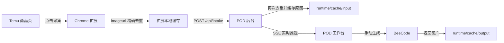

<div align="center">

# POD Image Workflow

**Temu 商品采集、图片缓存、BeeCode 印花提取与批量管理的一体化本地工作台**

[](https://nodejs.org/)
[](#安装-chrome-扩展)
[](#快速开始)
[](#数据与安全)

[快速开始](#快速开始) · [安装扩展](#安装-chrome-扩展) · [导入数据](#json-导入) · [接口说明](#http-与-sse) · [故障排查](#故障排查)

</div>

---

## 项目简介

POD Image Workflow 把 **Temu 图片采集 Chrome 扩展** 与 **BeeCode POD 印花提取工作台** 放在同一个仓库中。扩展采集商品后，后台负责去重、缓存原图并通过 SSE 实时通知页面。

> 自动导入的任务只会进入 **待生成** 状态。只有手动点击“生成”或“批量生成”才会调用 BeeCode，不会因为采集或刷新页面产生费用。

| 核心能力 | 行为 |
|---|---|
| 商品采集 | 获取 `imageurl`、`listing` 和编号，按完整图片 URL 精确去重 |
| 原图缓存 | JSON 导入最多 10 并发；502/503/504 或网络超时仅重试一次 |
| 批量生图 | 默认 3 并发滑动窗口，支持停止、重发和按当前提示词重新生成 |
| 状态恢复 | 输入图、生成图、提示词、日志和任务状态全部持久化 |
| 文件下载 | 使用 `listing` 商品标题命名，只保存图片，不生成 TXT |
| 联系表 | 当前页 50 张，10×5 排列，每格 600×600，输出 6000×3000 JPEG |

## 工作流程



- 服务在线：采集后立即同步到 POD。
- 服务离线：扩展保留数据并显示“待同步”。
- 再次打开 POD：`pod-bridge.js` 一次性提交旧缓存，不轮询页面。
- URL 重复：按钮直接显示“重复”，不会加入 JSON，也不会再次 POST。

## 快速开始

### 环境要求

- Windows 10/11
- Node.js 18 或更高版本
- Google Chrome 或兼容 Chromium 的浏览器

项目只使用 Node.js 内置模块，**不需要执行 `npm install`**。

### 一键启动

双击仓库根目录的：

```text
start.cmd
```

脚本将自动：

1. 检查 `http://127.0.0.1:8787/api/health`。
2. 服务未运行时，在后台启动 `node server/index.js`。
3. 等待健康检查通过。
4. 打开 `http://127.0.0.1:8787/`。

也可以在项目根目录手动启动：

```powershell
node server/index.js
```

## 配置

运行时只读取这一份实际配置：

```text
runtime/config.json
```

首次使用：

1. 参考 `config/config.example.json` 创建配置文件。
2. 填入 BeeCode API Key。
3. 在 POD 页面点击“配置文件”并导入。
4. 后台校验后原子写入 `runtime/config.json`，以后刷新或重启不需要重复选择。

```json
{
  "beecode": {
    "apiKey": "",
    "baseUrl": "https://beecode.cc",
    "model": "gpt-image-2",
    "size": "1024x1024",
    "concurrency": 3
  },
  "server": {
    "host": "127.0.0.1",
    "port": 8787
  }
}
```

`runtime/` 已被 Git 整目录忽略。接口和页面只返回脱敏 Key，完整 Key 不会出现在仓库或浏览器响应中。

## 安装 Chrome 扩展

1. 打开 `chrome://extensions/`。
2. 开启右上角“开发者模式”。
3. 点击“加载已解压的扩展程序”。
4. 选择 `extension/temu-image-downloader/`。
5. 保留默认的“POD 模式”。

修改扩展代码后，在扩展管理页点击一次“重新加载”。扩展仍保留独立的本地下载模式，可在设置页切换。

## JSON 导入

支持顶层数组，也支持对象中的 `data`、`items` 或 `list` 数组。

```json
[
  {
    "imageurl": "https://img.kwcdn.com/example.jpg",
    "listing": "Product title",
    "编号": "20260623194641_0001"
  }
]
```

| 字段 | 用途 |
|---|---|
| `imageurl` | 原图地址和精确去重键 |
| `listing` | 图片下方标题，也是生成图下载文件名 |
| `编号` | 完整保存；页面和合并图显示最后的后缀，如 `0001` |

JSON 导入只缓存原图，不会自动进入付费生图队列。

## POD 工作台

### 任务与生成

- 每页固定 50 条，避免一次渲染大量图片导致卡顿。
- 每个任务拥有独立提示词和运行日志。
- 顶部提示词可覆盖全部任务，也可以逐条修改。
- 生成请求动态读取任务当前提示词，并附加相似度与比例配置。
- 临时生成错误进入重试队列，等待 3 秒且最多重试一次。
- 支持单张生成、批量生成、停止、重新生成、重新获取、下载和删除。

### 下载

- 生成图使用 `listing` 商品标题命名。
- 不添加 `-beecode` 后缀。
- 不创建配套 TXT 文件。
- “下载本页”只处理当前页已完成任务，并自动跳过失败项。
- 可提前选择下载文件夹，浏览器允许时直接写入该目录。

### 合并本页

合并功能完全由浏览器 Canvas 完成，不调用 BeeCode：

```text
50 张 / 页
10 列 × 5 行
600 × 600 px / 格
6000 × 3000 px / 张
JPEG quality: 0.94
```

每张图片等比铺满并居中裁切；左上角使用约 52px 白色粗体编号，编号读取任务 `displayCode` 或 JSON `编号` 后缀。缺图会写入任务日志，但不会阻塞其他图片输出。

## 数据与安全

| 路径 | 内容 | 是否提交 Git |
|---|---|---|
| `runtime/config.json` | 唯一实际配置和 API Key | 否 |
| `runtime/tasks.json` | 任务状态、提示词、listing 和日志 | 否 |
| `runtime/cache/input/` | 原图缓存 | 否 |
| `runtime/cache/output/` | 已付费生成的图片 | 否 |
| `runtime/cache/contact-sheets/` | 合并本页输出 | 否 |
| `runtime/logs/server.log` | 服务日志 | 否 |

修改前端、刷新页面或重载扩展不会重新生成图片。不要删除 `runtime/`；需要迁移或备份时，直接复制整个目录。

旧 `beecode-cache/` 暂时保留为迁移备份，但当前程序不再读取它。

## HTTP 与 SSE

| 方法 | 路径 | 作用 |
|---|---|---|
| `GET` | `/api/health` | 健康检查和脱敏配置 |
| `GET / POST` | `/api/config` | 读取或替换唯一配置 |
| `GET` | `/api/tasks` | 恢复全部任务 |
| `POST` | `/api/intake` | 扩展单条导入 |
| `POST` | `/api/intake/batch` | JSON 或扩展缓存批量导入 |
| `POST` | `/api/intake/retry` | 重新获取远程原图 |
| `GET` | `/api/events` | SSE 任务事件流 |
| `POST` | `/v1/images/edits` | BeeCode 图片编辑代理 |

SSE 事件包括：

- `task.created`
- `task.updated`
- `task.deleted`
- `tasks.cleared`

浏览器使用原生 `EventSource` 自动重连，页面不需要持续轮询。

## 项目结构

<details>
<summary>展开查看目录树</summary>

```text
POD-html/
├─ app/
│  └─ index.html                         POD 单页前端
├─ server/
│  ├─ index.js                           HTTP 路由、BeeCode 代理、缓存接口
│  ├─ config.js                          唯一配置读取与原子写入
│  ├─ task-store.js                      任务存储、去重和 SSE 事件源
│  ├─ intake.js                          扩展及 JSON 导入、10 并发原图缓存
│  └─ sse.js                             实时事件推送
├─ extension/
│  └─ temu-image-downloader/
│     ├─ manifest.json
│     ├─ background.js                   去重、缓存、POST 和本地下载
│     ├─ content.js                      Temu 页面采集按钮
│     ├─ pod-bridge.js                   打开 POD 时同步扩展旧缓存
│     └─ popup.* / options.* / icons/
├─ config/
│  └─ config.example.json                可提交的无 Key 配置模板
├─ runtime/                              本机运行数据，Git 整目录忽略
│  ├─ config.json                        唯一实际配置
│  ├─ tasks.json                         任务状态和任务日志
│  ├─ cache/input/                       原图
│  ├─ cache/output/                      生成图
│  ├─ cache/contact-sheets/              合并图目录
│  └─ logs/server.log                    服务日志
├─ start.cmd                             Windows 一键启动
├─ update_plan.md                        整合设计与实施记录
└─ README.md
```

</details>

## 故障排查

| 现象 | 处理方式 |
|---|---|
| 页面打不开 | 运行 `start.cmd`，再访问 `http://127.0.0.1:8787/api/health` |
| 扩展显示“待同步” | 启动本机服务，然后打开或刷新 POD 页面 |
| JSON 原图返回 502 | 后台等待 3 秒重试一次，也可以点单行“重新获取” |
| BeeCode 请求失败 | 查看对应任务日志，HTTP 状态和响应正文都会保留 |
| 配置不生效 | 确认 JSON 合法，并检查页面顶部配置来源是否为 `runtime/config.json` |
| 刷新后任务缺失 | 检查 `runtime/tasks.json` 和服务日志，不要重新生成 |

---

<div align="center">

本项目默认仅监听 `127.0.0.1:8787`，用于本机 POD 工作流。

</div>
