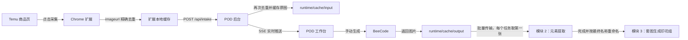

<div align="center">

# POD Image Workflow

**Temu 商品采集、印花重绘、Moonshot 元素提取与套图生成的一体化本地工作台**

[](https://nodejs.org/)
[](#安装-chrome-扩展)
[](#快速开始)
[](#数据与安全)

[快速开始](#快速开始) · [三模块 Workflow](#三模块-workflow) · [安装扩展](#安装-chrome-扩展) · [导入数据](#json-导入) · [接口说明](#http-与-sse) · [故障排查](#故障排查)

</div>

---

## 项目简介

POD Image Workflow 把 **Temu 图片采集 Chrome 扩展**、**印花重绘**、**元素提取** 与 **套图生成** 放在同一个本地工作台中。扩展采集商品后，后台负责去重、缓存原图并通过 SSE 实时通知页面；元素提取模块可独立选择本机图片目录，通过 Moonshot 批量生成可编辑的元素清单；套图生成模块在独立画布中把印花批量合成到产品底图。

> 自动导入的任务只会进入 **待生成** 状态。只有手动点击“生成”或“批量生成”才会调用 BeeCode，不会因为采集或刷新页面产生费用。

| 核心能力 | 行为 |
|---|---|
| 商品采集 | 获取 `imageurl`、`listing` 和编号，按完整图片 URL 精确去重 |
| 原图缓存 | JSON 导入最多 10 并发；502/503/504 或网络超时仅重试一次 |
| 批量生图 | 默认 3 并发、生成数量手输 1–4，支持取消、重发和按当前提示词重新生成 |
| 元素提取 | 每 9 张组成 3×3 标号图，默认 3 并发调用 Moonshot，结果可编辑并导出 |
| 套图生成 | 单工作区配置印花文件夹与多组底图/Mask，支持位置、缩放、旋转、混合、置换和曲线后导出 ZIP |
| Workflow | 模块 1 生成图批量传入模块 2，模块 2 重命名后的完成图批量传入模块 3 |
| 状态恢复 | 输入图、生成图、提示词、日志和任务状态全部持久化 |
| 文件下载 | 使用 `listing` 商品标题命名，只保存图片，不生成 TXT |
| 联系表 | 当前页 50 张，10×5 排列，审核图保存到 `runtime/cache/check/` |
| 缓存清空 | 点「清空」删除任务列表，并清空整个 `runtime/cache/`（含 input / output / check） |

## 工作流程



- 服务在线：采集后立即同步到 POD。
- 服务离线：扩展保留数据并显示“待同步”。
- 再次打开 POD：`pod-bridge.js` 一次性提交旧缓存，不轮询页面。
- URL 重复：按钮直接显示“重复”，不会加入 JSON，也不会再次 POST。
- Workflow 传输：只在当前浏览器会话中保存，刷新页面后需要从源模块重新传输。

## 快速开始

### 环境要求

- Windows 10/11
- Google Chrome 或兼容 Chromium 的浏览器
- **不必预先安装 Node**：`start.cmd` 会优先使用系统 PATH 中的 `node`；若没有，则自动下载便携 Node 20 到 `tools/node/`（优先 npmmirror，失败再走 nodejs.org）

项目只使用 Node.js 内置模块，**不需要执行 `npm install`**。

### 一键启动（推荐：桌面图标）

1. 首次拿到项目后，双击仓库根目录的 `install-desktop.cmd`  
   → 在当前用户桌面创建快捷方式 **POD Workbench**（图标优先用本机 Chrome）  
   → 项目搬家后，再双击一次该脚本即可覆盖更新快捷方式路径。
2. 以后只需双击桌面 **POD Workbench**（或仍双击根目录 `start.cmd`）。

`start.cmd` / `start.ps1` 将自动：

1. 解析 Node：系统 `node` → 已有 `tools/node/node.exe` → 否则下载便携 Node v20.18.1。  
2. 检查 `127.0.0.1:8787`；若是本项目的旧 POD 进程则结束并重启。  
3. 后台启动 `server/index.js`，健康检查通过后打开 `http://127.0.0.1:8787/`。  
4. 黑窗打印英文日志：成功约 2 秒后关闭；失败则 `pause` 便于查看原因。

完全离线且本机无 Node 时：把另一台机器上已下载好的整个 `tools/node/` 文件夹拷到项目里（保证存在 `tools/node/node.exe`），再启动。

也可以在项目根目录手动启动（需本机已有 Node）：

```powershell
node server/index.js
```

## 配置

业务配置与密钥配置已经分离：

```text
config.json
key.json
```

首次使用：

1. `config.json` 只保存业务配置（模型参数、侵权提示词、Listing 产品等），**不包含**图片中转节点列表。
2. 复制 `key.example.json` 为 `key.json`，填写 Moonshot 的 `baseurl`、`apikey`，并在 `trans_model_pool.nodes` 中按需增减节点（每个节点含 `id`、`name`、`baseurl`、`endpoint`、`model`、`price`、`apikey`）。
3. 也可在页面点击“载入密码”导入 `key.json`：后台会按文件内容**动态重建**节点列表，前端“选择节点”菜单随之增减，不锁死在 `config.json`。
4. 多节点时点击“选择节点”切换；当前节点 `active` 写入 `key.json`（个人偏好），不写进可分享的 `config.json`。

```json
{
  "shared": {
    "moonshot": {
      "model": "kimi-k2.6"
    },
    "server": {
      "host": "127.0.0.1",
      "port": 8787
    }
  },
  "patternRedraw": {
    "imageApi": {
      "endpoint": "/v1/images/edits",
      "model": "gpt-image-2",
      "size": "1024x1024",
      "concurrency": 3,
      "n": 4,
      "sizes": {
        "1:1": "1024x1024",
        "9:16": "1024x1824",
        "4:3": "1536x1152"
      },
      "similarityPrompt": "重要约束：输出图与输入图的主体轮廓、构图和核心图案保持约 {similarity}% 视觉相似度，其余部分进行原创重绘。"
    },
    "infringement": {
      "saveContactSheet": true,
      "outputDir": "runtime/cache/check",
      "prompt": "侵权审核系统提示词..."
    }
  },
  "elementExtraction": {
    "batchSize": 9,
    "concurrency": 3,
    "thinkingEnabled": false,
    "prefix": "",
    "suffix": "",
    "mode": "affix",
    "product_name": "地垫",
    "prompt_product_output_model": "Listing 模式公共货号与 JSON 输出规范...",
    "product_prompts": {
      "地垫": "地垫 Listing 的业务规则..."
    },
    "prompt_prefix_model": "前后缀模式使用的固定后台提示词..."
  }
}
```

```json
{
  "baseurl": "https://api.moonshot.cn/v1",
  "apikey": "",
  "trans_model_pool": {
    "active": "node-1",
    "nodes": [
      {
        "id": "node-1",
        "name": "节点1-beecode",
        "baseurl": "https://beeapi.ai",
        "endpoint": "/v1/images/edits",
        "model": "gpt-image-2",
        "price": {
          "1k": 0.02,
          "2k": 0.04,
          "4K": 0.08
        },
        "apikey": ""
      }
    ]
  }
}
```

`shared` 放“印花重绘”和“元素提取”共用的模型与服务配置；`patternRedraw` 对应“印花重绘”；`elementExtraction` 对应“元素提取”。图片中转节点列表在 `key.json` 的 `trans_model_pool` 中动态维护，公司可共享同一份 `config.json`，每人自备 `key.json` 增减节点与密钥。“套图生成”当前完全在浏览器内存中运行，不读取或写入配置。`prompt_prefix_model` 不显示为页面输入框，但会由前端注入当前批次货号后与图片一起发送给本地后台。Listing 产品由根目录 `config.json` 中的 `product_prompts` 管理；页面“管理产品”弹窗新增、修改或删除产品时只会原子更新根目录的这些产品字段。`n` 控制每次返回数量（1–4），`sizes` 将页面比例直接映射到 `/v1/images/edits` 的 `size`。

`key.json` 和 `runtime/` 均被 Git 忽略。Moonshot 与图片中转节点的完整 API Key、节点地址均只保存在 `key.json`；`config.json` 可安全分享业务参数。接口和页面只返回脱敏 Key。兼容旧版仅含 `trans_model_keys` 的 `key.json`：启动时会按节点 ID 合并并迁移为完整 `trans_model_pool`。

## 安装 Chrome 扩展

1. 打开 `chrome://extensions/`。
2. 开启右上角“开发者模式”。
3. 点击“加载已解压的扩展程序”。
4. 选择 `extension/temu-image-downloader/`。
5. 保留默认的“POD 模式”。

修改扩展代码后，在扩展管理页点击一次“重新加载”。扩展仍保留独立的本地下载模式，可在设置页切换。

## JSON 导入

支持顶层数组，也支持对象中的 `data`、`items` 或 `list` 数组。

```json
[
  {
    "imageurl": "https://img.kwcdn.com/example.jpg",
    "listing": "Product title",
    "编号": "20260623194641_0001"
  }
]
```

| 字段 | 用途 |
|---|---|
| `imageurl` | 原图地址和精确去重键 |
| `listing` | 图片下方标题，也是生成图下载文件名 |
| `编号` | 完整保存；页面和合并图显示最后的后缀，如 `0001` |

JSON 导入只缓存原图，不会自动进入付费生图队列。

## 模块 1：印花重绘

### 任务与生成

- 每页固定 50 条，避免一次渲染大量图片导致卡顿。
- 每个任务拥有独立提示词和运行日志。
- 顶部提示词可覆盖全部任务，也可以逐条修改。
- 生成请求动态读取任务当前提示词，只注入相似度强约束；比例直接映射到接口 `size`。
- 每个任务缓存接口返回的全部图片，预览区可左右轮换。
- 临时生成错误进入重试队列，等待 3 秒且最多重试一次。
- 单次图片生成请求最多等待 5 分钟；点击“停止”会取消在途请求，任务恢复为“待生成”且不会计入失败或自动重试。
- 输入图和生成图采用先写新版本、再切换任务引用的方式缓存，重新生成写入失败时保留原有图片。
- 支持单张生成、批量生成、停止、重新生成、重新获取、下载和删除。
- 顶部“批量传输”遍历全部分页中的已完成任务，每个任务只取第一张生成图；文件名优先使用 `displayCode` / `sourceCode` / 任务 id，避免跨任务同名覆盖。
- 传输失败的图片直接跳过，不阻塞其他图片；按钮旁显示成功、跳过和失败数量。
- 点右上角「清空」会先停止进行中的生成，再删除全部任务，并清空磁盘上的 `runtime/cache/`（原图、生成图、侵权拼图）。

### 下载

- 生成图使用 `listing` 商品标题命名。
- 不添加 `-beecode` 后缀。
- 不创建配套 TXT 文件。
- 单行“下载”只保存当前预览图；“下载本页”保存全部返回图，并添加 `-01`、`-02` 等序号。
- 可提前选择下载文件夹，浏览器允许时直接写入该目录。

### 合并本页

合并功能完全由浏览器 Canvas 完成，不调用 BeeCode：

```text
50 张 / 页
10 列 × 5 行
600 × 600 px / 格
浏览器画布：6000 × 3000 px
后台审核图：最长边不超过 4096 px，JPEG quality 0.86
```

每张图片等比铺满并居中裁切；左上角使用约 52px 白色粗体编号，编号读取任务 `displayCode` 或 JSON `编号` 后缀。缺图会写入任务日志，但不会阻塞其他图片输出。

浏览器不会再下载合并图。合并图缩放至 4K 以内后由后台保存到 `runtime/cache/check/`（与任务图同属 Cache，点「清空」一并删除），并发送到 Moonshot 中国区的 `kimi-k2.6` 进行侵权风险审核。审核规则读取 `patternRedraw.infringement.prompt`。审核请求超时为 **20 分钟**（本机 Node `requestTimeout` 同步覆盖）；失败卡片会显示上游 HTTP 状态、响应头和截断后的响应正文。审核结果以气泡卡片显示编号、风险等级和原因；没有发现风险项时也会显示明确结果。

## 模块 2：元素提取

- 可以独立选择本机图片目录，也可以接收模块 1 的批量传输；新批次会覆盖当前图片和提取结果。
- 按文件名自然排序，每 9 张生成一张 3×3 标号图，文件名去除扩展名后作为货号。
- 批次并发可选 1–4，默认 3；单批失败会标记为可重试，不阻塞其余批次。
- 请求由后台使用 `shared.moonshot` 配置发起，完整 API Key 不进入浏览器。
- Moonshot 使用 SSE 逐事件读取；页面不打印逐字增量，只在完成后显示最终 JSON，同时保留 5 秒心跳和 30 秒无事件告警。快速模式请求超时为 180 秒，深度推理模式为 300 秒。
- “模型模式”按钮可切换“不推理·快速”和“推理·较慢”；默认读取 `elementExtraction.thinkingEnabled`，不推理模式会发送 `thinking: {"type":"disabled"}`。
- “前后缀模式”固定读取 `prompt_prefix_model`；提取完成后可修改前缀、后缀并立即重新组合，不会再次请求模型。
- “Listing 模式”只允许从已配置产品中选择。请求会组合该产品的业务 Prompt 与 `prompt_product_output_model` 公共 JSON 规范；普通使用界面不显示 Prompt。
- “管理产品”弹窗支持新增、修改和删除 `{名称, Prompt}`，初始产品为“地垫”，配置保存到根目录 `config.json`。
- 前后缀结果和每个 Listing 产品的结果分别保存在页面内存中，切换模式或产品会恢复各自结果；重新选择图片目录时统一清空。
- 结果仅保存在当前页面内存，可编辑后导出 JSON 或 Excel；SheetJS 未加载时自动降级为 CSV。
- “导出图片文件夹”会将已完成原图按前后缀组合结果重命名并写入新目录；重名自动追加序号。
- 结果区“批量传输”使用与“导出图片文件夹”完全相同的完成条件和重命名规则，直接覆盖模块 3 的“印花组”，不弹出目录选择器；成功数量以模块 3 实际载入回执为准。
- 失败结果支持逐行“手动重试”，也可使用侧栏按钮批量重试全部未识别项。

## 模块 3：套图生成

- 使用独立 iframe 画布，当前仅保留一个套图工作区。
- 可手动选择印花文件夹，也可接收模块 2 的批量传输。
- Workflow 传入新图片时只覆盖“印花组”，不会清除产品底图、Mask、位置、缩放、混合模式、置换参数或明暗曲线。
- 新印花全部完成校验后才替换旧组；坏图单独计入失败，旧 Blob URL 会在替换或页面退出时释放。
- 传输完成后只载入图片并刷新预览，不会自动开始套图生成或导出。

## 三模块 Workflow

Workflow 协调逻辑集中在 `app/workflow/workflow-manager.js`，模块之间传递浏览器 `File` 对象，不需要先写入临时文件夹。

### 模块 1 → 模块 2

1. 在“印花重绘”完成所需任务。
2. 点击顶部“批量传输”。
3. 系统遍历全部任务而不是仅处理当前分页；失败、待生成或没有输出的任务会跳过。
4. 多图任务固定传第一张；文件名使用 `displayCode` / `sourceCode` / 任务 id，保证跨任务唯一。
5. 模块 2 的旧图片和旧结果被覆盖，页面自动切换到“元素提取”，但不会自动调用 Moonshot。

### 模块 2 → 模块 3

1. 完成元素提取或 Listing 生成，并按需编辑最终结果。
2. 点击结果区“批量传输”。
3. 系统只选择状态为“已完成”且最终名称非空的图片，按照图片文件夹导出规则生成合法且不重复的文件名。
4. 页面自动切换到“套图生成”，新批次覆盖“印花组”，现有产品模板和效果设置保持不变。

两段传输都采用“成功项继续、失败项跳过”的策略，并显示本批成功、跳过或失败数量。Workflow 数据仅存在于当前浏览器会话；刷新页面后不会自动恢复模块 2 的结果和待传批次，但模块 1 的持久化任务仍可重新传输。仅重启后台服务而不刷新页面时，当前页面内存不会立即丢失。

## 数据与安全

| 路径 | 内容 | 是否提交 Git |
|---|---|---|
| `config.json` | 业务配置（不含节点池） | 是 |
| `key.json` | Moonshot 凭据 + `trans_model_pool` 动态节点（含 apikey） | 否 |
| `runtime/tasks.json` | 任务状态、提示词、listing 和日志 | 否 |
| `runtime/cache/input/` | 原图缓存 | 否 |
| `runtime/cache/output/` | 已付费生成的图片 | 否 |
| `runtime/cache/check/` | 侵权查询合并图 | 否 |
| `runtime/logs/server.log` | 服务日志 | 否 |

跨模块 Workflow 的 `File` 对象只存在于浏览器内存，不写入 `runtime/`。模块 1 原有任务和输出缓存仍按上表持久化；模块 2 的提取结果、模块 3 的画布状态及传输批次刷新后清空。

修改前端、刷新页面或重载扩展不会重新生成图片。

**清空缓存：** 页面右上角「清空」会删除 `runtime/tasks.json` 中的任务记录，并清空整个 `runtime/cache/`（`input` / `output` / `check`）。`runtime/logs/` 与配置文件不会被删除。需要迁移或备份时，直接复制整个 `runtime/` 目录。

## HTTP 与 SSE

| 方法 | 路径 | 作用 |
|---|---|---|
| `GET` | `/mockup` | 独立套图生成页面 |
| `GET` | `/app/workflow/workflow-manager.js` | 三模块会话内文件传输管理器 |
| `GET` | `/api/health` | 健康检查和脱敏配置 |
| `GET / POST` | `/api/config` | 读取或替换业务配置 |
| `POST` | `/api/keys` | 载入本机 `key.json` |
| `POST` | `/api/trans-model-node` | 切换图片中转节点 |
| `GET / POST` | `/api/element-products` | 读取或管理根目录 Listing 产品配置 |
| `GET` | `/api/tasks` | 恢复全部任务 |
| `POST` | `/api/intake` | 扩展单条导入 |
| `POST` | `/api/intake/batch` | JSON 或扩展缓存批量导入 |
| `POST` | `/api/intake/retry` | 重新获取远程原图 |
| `GET` | `/api/events` | SSE 任务事件流 |
| `POST` | `/v1/images/edits` | BeeCode 图片编辑代理 |
| `POST` | `/api/infringement-check` | Moonshot 合并图侵权审核代理 |
| `POST` | `/api/element-extract` | Moonshot 3×3 元素提取代理 |
| `DELETE` | `/cache/tasks` | 清空全部任务与 `runtime/cache/`（含侵权拼图 check） |
| `DELETE` | `/cache/task?id=` | 删除单个任务及其输入/输出缓存文件 |

SSE 事件包括：

- `task.created`
- `task.updated`
- `task.deleted`
- `tasks.cleared`
- `element.extraction.trace`：元素提取后台节点，以及 Moonshot 每个已脱敏 `data:` 响应事件的实时转发。

浏览器使用原生 `EventSource` 自动重连，页面不需要持续轮询。

## 项目结构

<details>
<summary>展开查看目录树</summary>

```text
POD-html/
├─ app/
│  ├─ index.html                         三模块 POD 单页前端
│  ├─ element-extraction.js              元素提取目录、批次、编辑与导出
│  ├─ mockup.html                         独立套图画布与 ZIP 导出
│  ├─ workflow/
│  │  └─ workflow-manager.js             三模块会话内 File 传输协调器
│  └─ vendor/jszip.min.js                 本地 ZIP 压缩依赖
├─ server/
│  ├─ index.js                           HTTP 路由、BeeCode 代理、缓存接口
│  ├─ config.js                          唯一配置读取与原子写入
│  ├─ task-store.js                      任务存储、去重和 SSE 事件源
│  ├─ intake.js                          扩展及 JSON 导入、10 并发原图缓存
│  └─ sse.js                             实时事件推送
├─ extension/
│  └─ temu-image-downloader/
│     ├─ manifest.json
│     ├─ background.js                   去重、缓存、POST 和本地下载
│     ├─ content.js                      Temu 页面采集按钮
│     ├─ pod-bridge.js                   打开 POD 时同步扩展旧缓存
│     └─ popup.* / options.* / icons/
├─ runtime/                              本机运行数据，Git 整目录忽略
│  ├─ tasks.json                         任务状态和任务日志
│  ├─ cache/
│  │  ├─ input/                          原图
│  │  ├─ output/                         生成图
│  │  └─ check/                          侵权查询合并图（随「清空」删除）
│  └─ logs/server.log                    服务日志
├─ start.cmd                             Windows 一键启动入口
├─ start.ps1                             启动逻辑：Node 解析 / 便携下载 / 起服务
├─ install-desktop.cmd                   安装桌面快捷方式 POD Workbench
├─ tools/node/                           便携 Node（首次自动下载，gitignore）
├─ config.json                           业务配置（不含节点池，可分享）
├─ config.example.json                   业务配置模板
├─ key.json                              Moonshot + 动态图片节点池（含密钥）
├─ key.example.json                      密钥结构模板
├─ update_plan.md                        整合设计与实施记录
└─ README.md
```

</details>

## 故障排查

| 现象 | 处理方式 |
|---|---|
| 页面打不开 | 运行 `start.cmd`，再访问 `http://127.0.0.1:8787/api/health` |
| 提示找不到 Node / 下载失败 | 确认能访问 npmmirror 或 nodejs.org；或从有网机器拷贝整个 `tools/node/`（需含 `node.exe`） |
| 8787 端口被占用 | `start.cmd` 只会重启当前项目的 `server/index.js`；其他程序占用时不会被终止，请先处理端口冲突 |
| 桌面图标失效 | 项目移动后重新双击 `install-desktop.cmd` 覆盖快捷方式 |
| 扩展显示“待同步” | 启动本机服务，然后打开或刷新 POD 页面 |
| JSON 原图返回 502 | 后台等待 3 秒重试一次，也可以点单行“重新获取” |
| BeeCode 请求失败 | 查看对应任务日志，HTTP 状态和响应正文都会保留；超过 5 分钟会按超时处理 |
| 侵权审核超时/空结果 | 审核最长约 20 分钟；确认 Moonshot Key 可用，并查看 `runtime/logs/server.log` |
| 点清空后图片仍在磁盘 | 确认已刷新到最新前端，且服务已重启；应清空整个 `runtime/cache/` |
| 配置不生效 | 检查 `config.json` 与 `key.json` 是否为合法 JSON；密钥只在 `key.json` |
| 刷新后任务缺失 | 检查 `runtime/tasks.json` 和服务日志，不要重新生成 |
| 批量传输数量为 0 | 模块 1 需至少有一个已完成且有输出的任务；模块 2 需至少有一个最终名称非空的已完成结果 |
| 模块 3 未收到印花 | 确认使用 `http://127.0.0.1:8787/` 打开主页面，并刷新一次以加载最新 workflow 脚本 |

---

<div align="center">

本项目默认仅监听 `127.0.0.1:8787`，用于本机 POD 工作流。

</div>
